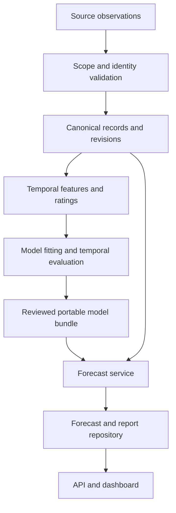

# Native platform architecture

Version 0.3 separates source observations, canonical football identities, point-in-time features, model research and operational transport. The legacy package remains executable but is not imported by the native API; the explicit Elo parity adapter reuses its tested rating formula.

| Layer | Responsibility | Boundary |
|---|---|---|
| data/domain | Source contracts, canonical entities, score basis, scope, aliases | Invalid/ambiguous data is excluded or quarantined |
| features/ratings | As-of form, context, Elo and Glicko | Future and unavailable observations are ineligible |
| models/evaluation | Training, calibration, paired folds, diagnostics | Explicit samples, target policy and fitting identities |
| experiments | Immutable manifests and content identities | No in-place mutation of a published experiment |
| services | Training bundles, forecasts, market joins, intelligence | Domain operations independent of HTTP |
| storage | Append-only SQLite revisions and immutable files | Atomic writes, integrity hashes, cutoff reads, online backup |
| operations/cli | Validation, ingestion, candidate review, serving, reports | Explicit source/license/assumption arguments |
| api/dashboard | Authenticated transport and analytical views | Dashboard consumes API rather than bypassing it |

## Storage and model lifecycle

Operational data lives in one SQLite database with WAL and a 30-second busy timeout. Revision selection requires `available_at <= as_of` and `recorded_at <= as_of`; the latest known recording wins per entity. Keyset pagination retains a fixed as-of timestamp across pages. Concurrent writers serialize through SQLite. This is a single-instance baseline, not a distributed feature store.

Model candidates contain validated portable frequency/logistic/tree and Poisson state, optional calibration/ensemble transforms, frozen training records, canonical catalogs and feature context. All inference is JSON plus numeric operations. Exported sklearn classifiers are checked for prediction parity before publication; the locked exporter version and regression tests protect the private tree-export boundary.

Training does not promote a model. A research report with the same source digest is linked, then an operator records a review reason. The API rejects unapproved or stale bundles. Reviewers must verify model families, feature declarations, temporal cohorts, metrics and intended use: digest matching is provenance evidence, not automatic scientific approval.

## Failure behavior

Batch match imports and snapshot imports validate before transactional insertion. Conflicting revisions roll back. Unknown canonical IDs, score bases, schema versions, unavailable classes and incompatible artifacts fail explicitly. No trained model silently falls back to another model. Request payloads are bounded, business routes authenticate, and health checks exercise SQLite integrity.

## Operational limits

The bundle intentionally freezes historical features. New results require retraining; fresh odds can still annotate a forecast as a separate market comparison. Research flat-file availability assumptions are visible in every bundle. Bitemporal storage records revisions observed after deployment; it cannot reconstruct revisions never collected.

Team/watchlist reports replay available histories on demand. They are intended for national-team research scale; no throughput or latency SLO is claimed. Use measured workloads before caching, adding workers, or migrating storage.
